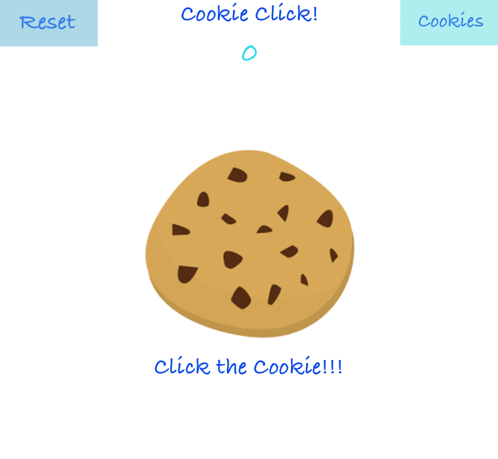
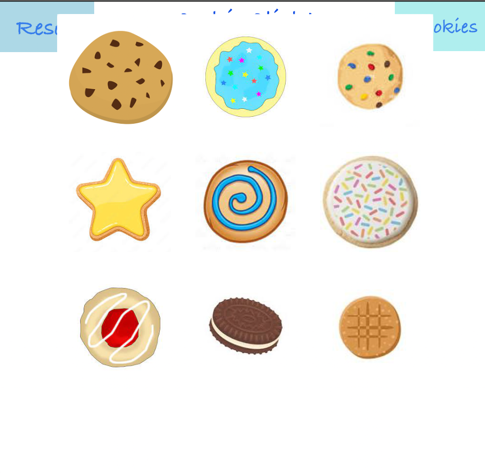
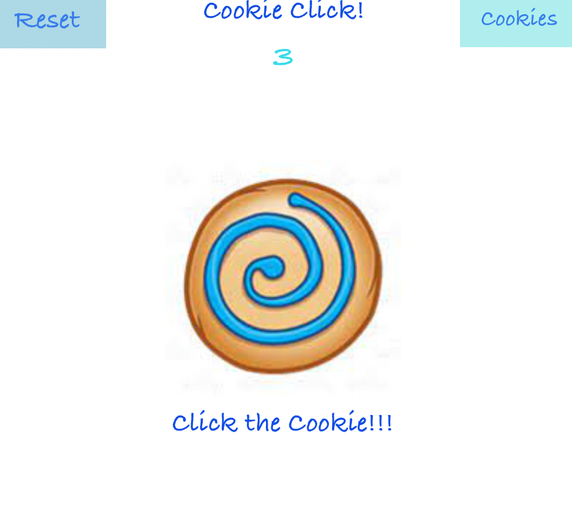

# Cookie Click
Based on the online game "Cookie Clicker," Cookie Click is an interactive cookie-themed clicking game.
The player simply clicks on the cookie to increase their score.
By clicking on the "Cookies" button, the player is given 9 different cookies to choose from.
The player may also choose to restart the game by clicking on the "Reset" button.
Score and cookie choice are persisted through the score.txt and currentCookie.txt files.

# Visuals

Main Screen

Cookies Menu

Alternate Main Screen